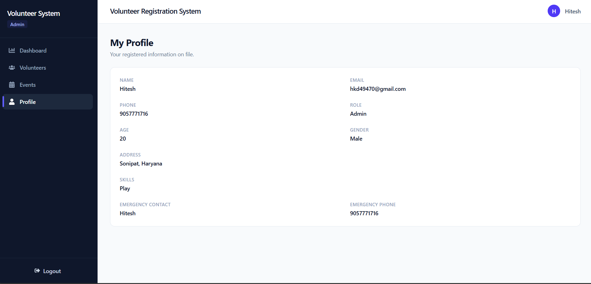
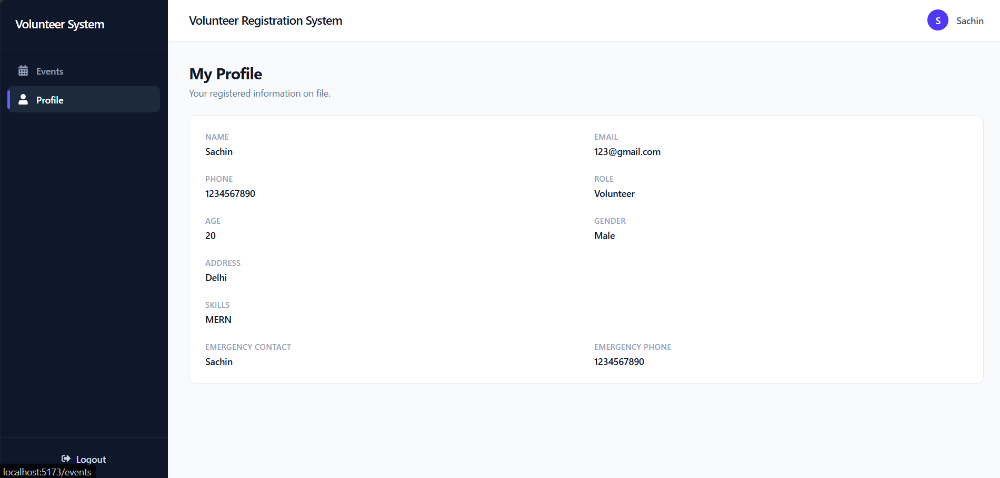
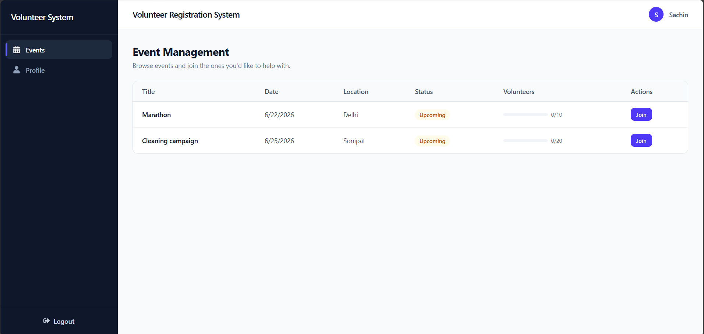

# Volunteer Management System

A MERN app for running a volunteer program — admins create events and manage volunteers, volunteers sign up and join events they want to help with.

## Tech Stack

**Frontend**
- React 19 + Vite
- React Router
- Tailwind CSS v4
- Axios
- Recharts (dashboard charts)
- React Icons

**Backend**
- Node.js + Express 5
- MongoDB + Mongoose
- JSON Web Tokens (JWT) for authentication
- bcrypt for password hashing

## Features

- Register/login with two roles: `admin` and `volunteer`
- Admin dashboard with volunteer/event counts and a couple of charts
- Admins can view and delete volunteers, create and delete events
- Volunteers can browse events and join/leave them
- Admins can also manually assign or remove a volunteer from an event (from the volunteer's detail page)
- Events show a fill bar for how many volunteers have joined vs how many are needed, and stop accepting joins once full
- Everyone can see their own profile info
- Protected routes on the frontend + JWT/role checks on the backend

## Screenshots

### Login
Email/password login with a link to register.


### Register
Volunteer sign-up form capturing contact, skills, and emergency contact details.


### Admin Dashboard
Stat cards plus a system overview bar chart and event status donut chart.


### Volunteers (Admin)
List of registered volunteers with View and Delete actions.


### Event Management (Admin)
Create-event form and a table of existing events with status and capacity.


### Profile
Same layout for both roles, just different data.




### Events (Volunteer)
A volunteer's view of upcoming events with a Join action.



## Project Structure

```
.
├── frontend/
│   ├── public/
│   ├── src/
│   │   ├── assets/
│   │   ├── components/
│   │   │   ├── DashboardCharts.jsx
│   │   │   ├── Navbar.jsx
│   │   │   └── Sidebar.jsx
│   │   ├── context/
│   │   │   └── AuthContext.jsx
│   │   ├── layouts/
│   │   │   └── DashboardLayout.jsx
│   │   ├── pages/
│   │   │   ├── AdminDashboard.jsx
│   │   │   ├── Events.jsx
│   │   │   ├── Login.jsx
│   │   │   ├── Profile.jsx
│   │   │   ├── Register.jsx
│   │   │   ├── VolunteerDetails.jsx
│   │   │   └── Volunteers.jsx
│   │   ├── routes/
│   │   │   └── ProtectedRoute.jsx
│   │   ├── services/
│   │   │   └── api.js
│   │   ├── App.jsx
│   │   ├── index.css
│   │   └── main.jsx
│   ├── .env
│   ├── eslint.config.js
│   ├── index.html
│   ├── package.json
│   ├── package-lock.json
│   ├── postcss.config.js
│   └── vite.config.js
│
├── server/
│   ├── config/
│   │   └── db.js
│   ├── controllers/
│   │   ├── authController.js
│   │   ├── dashboardController.js
│   │   ├── eventController.js
│   │   └── volunteerController.js
│   ├── middleware/
│   │   ├── authMiddleware.js
│   │   ├── errorHandler.js
│   │   └── roleMiddleware.js
│   ├── models/
│   │   ├── Event.js
│   │   └── User.js
│   ├── routes/
│   │   ├── authRoutes.js
│   │   ├── dashboardRoutes.js
│   │   ├── eventRoutes.js
│   │   └── volunteerRoutes.js
│   ├── utils/
│   │   ├── AppError.js
│   │   └── generateToken.js
│   ├── .env
│   ├── index.js
│   ├── package.json
│   └── package-lock.json
│
├── screenshots/
│   ├── ss1.png
│   ├── ss2.png
│   ├── ss3.png
│   ├── ss4.png
│   ├── ss5.png
│   ├── ss6.png
│   ├── ss7.png
│   └── ss8.png
│
├── .gitignore
├── LICENSE
└── README.md
```

## Getting Started

### Prerequisites
- Node.js 18+
- A MongoDB instance (local or [MongoDB Atlas](https://www.mongodb.com/atlas))

### 1. Clone the repository

```bash
git clone <your-repo-url>
cd <your-repo-name>
```

### 2. Backend setup

```bash
cd server
npm install
```

Create a `.env` file in `server/`:

```env
PORT=5000
MONGO_URI=mongodb://localhost:27017
DB_NAME=volunteer_management
JWT_SECRET=replace_with_a_long_random_string
CLIENT_URL=http://localhost:5173
NODE_ENV=development
```

Start the server:

```bash
npm run dev
```

The API runs at `http://localhost:5000`.

### 3. Frontend setup

```bash
cd frontend
npm install
```

Create a `.env` file in `frontend/`:

```env
VITE_API_URL=http://localhost:5000/api
```

Start the dev server:

```bash
npm run dev
```

The app runs at `http://localhost:5173`.

### 4. Create your first admin

New registrations default to the `volunteer` role. To create an admin, register normally, then update that user's `role` field to `"admin"` directly in MongoDB:

```js
db.users.updateOne(
  { email: "admin@example.com" },
  { $set: { role: "admin" } }
)
```

## API Overview

| Method | Endpoint | Access | Description |
|---|---|---|---|
| POST | `/api/auth/register` | Public | Register a new volunteer |
| POST | `/api/auth/login` | Public | Log in and receive a JWT |
| GET | `/api/auth/profile` | Authenticated | Get the logged-in user's profile |
| PUT | `/api/auth/profile` | Authenticated | Update the logged-in user's own profile |
| GET | `/api/dashboard/stats` | Admin | Volunteer/event summary stats |
| GET | `/api/volunteers` | Admin | List all volunteers |
| GET | `/api/volunteers/:id` | Admin | Get a single volunteer |
| PUT | `/api/volunteers/:id` | Admin | Update a volunteer |
| DELETE | `/api/volunteers/:id` | Admin | Delete a volunteer |
| GET | `/api/events` | Authenticated | List all events |
| GET | `/api/events/:id` | Authenticated | Get a single event |
| POST | `/api/events` | Admin | Create an event |
| PUT | `/api/events/:id` | Admin | Update an event |
| DELETE | `/api/events/:id` | Admin | Delete an event |
| POST | `/api/events/:id/join` | Authenticated | Join an event (self) |
| POST | `/api/events/:id/leave` | Authenticated | Leave an event (self) |
| POST | `/api/events/:id/assign` | Admin | Assign a specific volunteer to an event |
| POST | `/api/events/:id/remove` | Admin | Remove a specific volunteer from an event |

## License

MIT — see [LICENSE](./LICENSE).