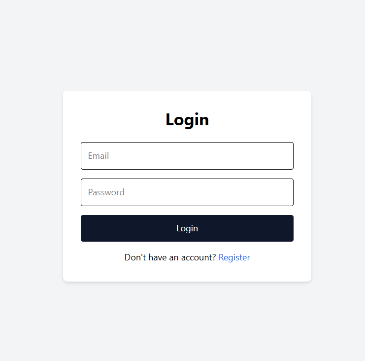
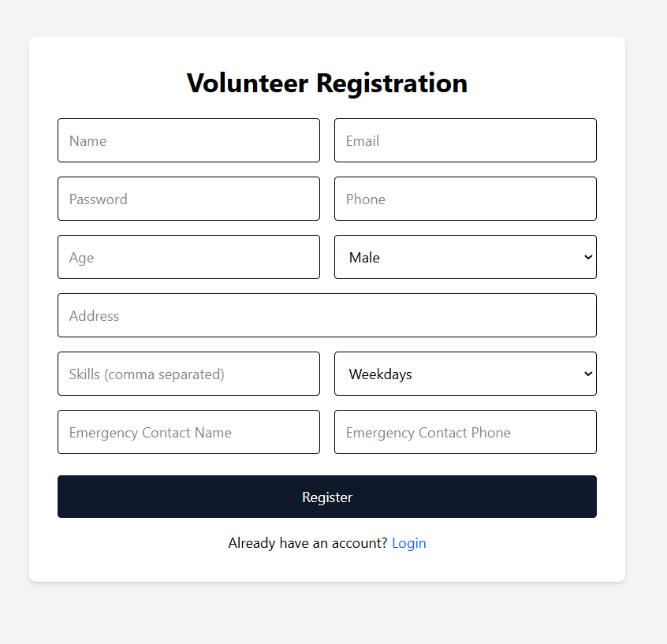
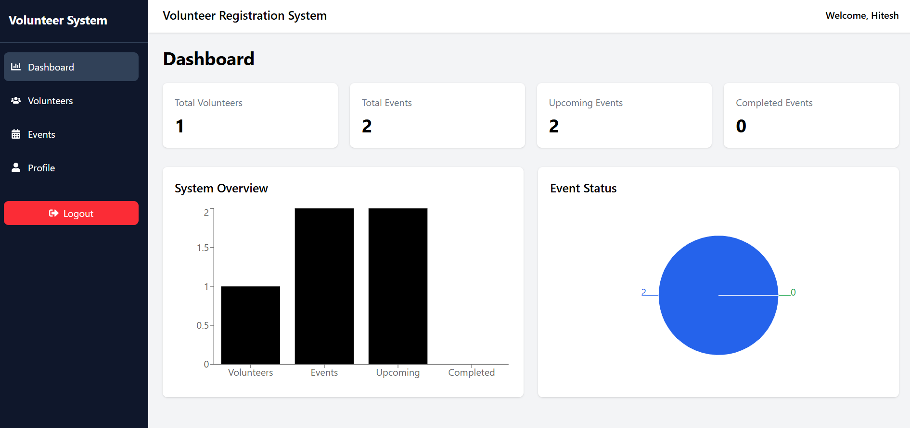
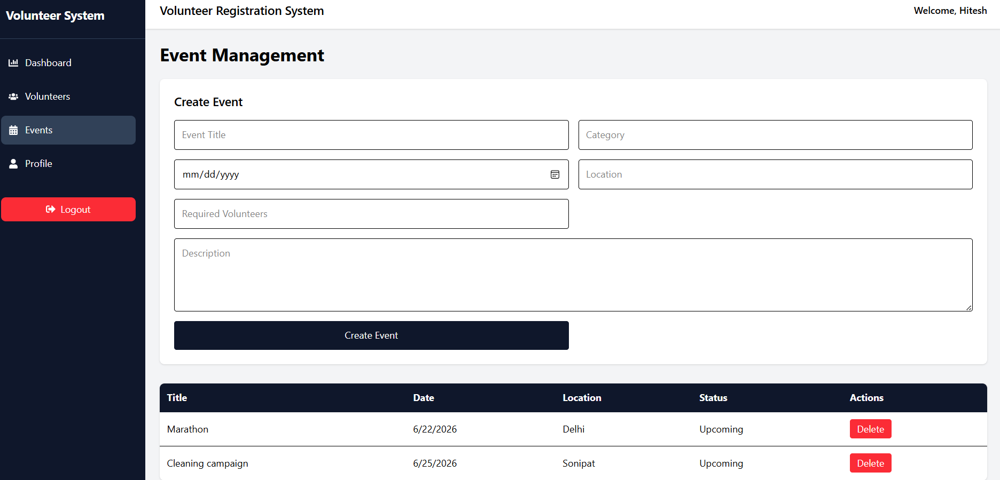
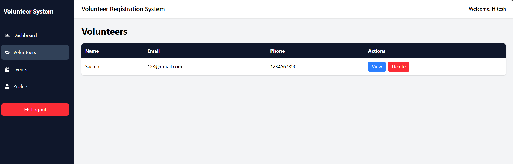
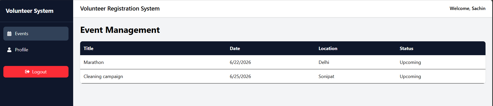
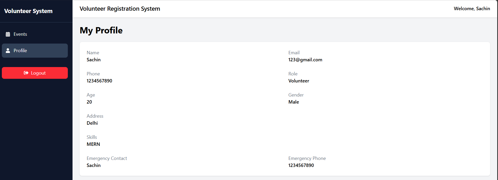

# Volunteer Management System

A full-stack MERN-based Volunteer Management System designed to streamline volunteer registration, event management, and administrative operations through a secure role-based platform. The system enables administrators to manage volunteers and events while allowing volunteers to register, access events, and maintain their profiles.

---

## Features

### Admin Features

* Secure Admin Authentication
* Dashboard with Analytics
* View Total Volunteers
* View Total Events
* Track Upcoming Events
* Track Completed Events
* Create Events
* View All Events
* Delete Events
* View All Volunteers
* View Volunteer Details
* Delete Volunteers
* Role-Based Access Control
* Visual Statistics using Charts

### Volunteer Features

* Volunteer Registration
* Secure Login
* View Available Events
* Access Personal Profile
* Update Profile Information
* Secure Logout

---

## Screenshots

### Login Page


### Registration Page


### Admin Dashboard



### Event Management



### Volunteer Management



### Event Details




### Profile



---

## Tech Stack

### Frontend

| Technology        | Purpose                         |
| ----------------- | ------------------------------- |
| React.js          | User Interface                  |
| React Router DOM  | Client-Side Routing             |
| Tailwind CSS      | Styling                         |
| Axios             | API Communication               |
| Recharts          | Dashboard Analytics             |
| React Icons       | UI Icons                        |
| React Context API | Authentication State Management |
| Vite              | Frontend Build Tool             |

### Backend

| Technology | Purpose                         |
| ---------- | ------------------------------- |
| Node.js    | Runtime Environment             |
| Express.js | REST API Development            |
| JWT        | Authentication & Authorization  |
| Bcrypt.js  | Password Hashing                |
| CORS       | Cross-Origin Resource Sharing   |
| Dotenv     | Environment Variable Management |

### Database

| Technology | Purpose         |
| ---------- | --------------- |
| MongoDB    | NoSQL Database  |
| Mongoose   | ODM for MongoDB |

---

## Project Structure

```text
Volunteer-Management-System
│
├── frontend
│   │
│   ├── public
│   │
│   ├── src
│   │   │
│   │   ├── components
│   │   │   ├── DashboardCharts.jsx
│   │   │   ├── Navbar.jsx
│   │   │   └── Sidebar.jsx
│   │   │
│   │   ├── context
│   │   │   └── AuthContext.jsx
│   │   │
│   │   ├── layouts
│   │   │   └── DashboardLayout.jsx
│   │   │
│   │   ├── pages
│   │   │   ├── AdminDashboard.jsx
│   │   │   ├── Events.jsx
│   │   │   ├── Login.jsx
│   │   │   ├── Profile.jsx
│   │   │   ├── Register.jsx
│   │   │   ├── VolunteerDetails.jsx
│   │   │   └── Volunteers.jsx
│   │   │
│   │   ├── routes
│   │   │   └── ProtectedRoute.jsx
│   │   │
│   │   ├── services
│   │   │   └── api.js
│   │   │
│   │   ├── App.jsx
│   │   └── main.jsx
│   │
│   ├── package.json
│   └── vite.config.js
│
├── backend
│   │
│   ├── config
│   │   └── db.js
│   │
│   ├── controllers
│   │   ├── authController.js
│   │   ├── dashboardController.js
│   │   ├── eventController.js
│   │   └── volunteerController.js
│   │
│   ├── middleware
│   │   ├── authMiddleware.js
│   │   ├── roleMiddleware.js
│   │   └── errorHandler.js
│   │
│   ├── models
│   │   ├── User.js
│   │   └── Event.js
│   │
│   ├── routes
│   │   ├── authRoutes.js
│   │   ├── dashboardRoutes.js
│   │   ├── eventRoutes.js
│   │   └── volunteerRoutes.js
│   │
│   ├── utils
│   │   ├── AppError.js
│   │   └── generateToken.js
│   │
│   ├── index.js
│   └── package.json
│
├── screenshots
│   ├── ss1.png
│   ├── ss2.png
│   ├── ss3.png
│   ├── ss4.png
│   ├── ss5.png
│   ├── ssL.png
│   └── ssR.png
│
└── README.md
```

---

## Authentication & Authorization

The system uses JWT-based authentication and role-based authorization.

### Roles

#### Admin

* Access Dashboard
* Manage Volunteers
* View Volunteer Details
* Manage Events
* Access Analytics

#### Volunteer

* View Events
* Access Profile
* Update Personal Information

---

## Dashboard Analytics

The Admin Dashboard provides:

* Total Volunteers
* Total Events
* Upcoming Events
* Completed Events
* Bar Chart Visualization
* Pie Chart Visualization

---

## Database Models

### User Model

Stores:

* Name
* Email
* Password
* Phone Number
* Age
* Gender
* Address
* Skills
* Availability
* Emergency Contact Details
* User Role

### Event Model

Stores:

* Event Title
* Description
* Date
* Location
* Category
* Required Volunteers
* Assigned Volunteers
* Event Status

---

## API Modules

### Authentication API

* Register User
* Login User
* Get Profile
* Update Profile

### Volunteer API

* Get Volunteers
* Get Volunteer By ID
* Update Volunteer
* Delete Volunteer

### Event API

* Create Event
* Get Events
* Get Event By ID
* Update Event
* Delete Event

### Dashboard API

* Get Dashboard Statistics

---

## Key Highlights

* Full Stack MERN Application
* JWT Authentication
* Role-Based Authorization
* Dashboard Analytics
* Volunteer Management
* Event Management
* Responsive User Interface
* RESTful API Architecture
* MongoDB Integration
* Secure Password Storage using Bcrypt

---

## Conclusion

The Volunteer Management System provides a centralized solution for managing volunteers and events. Through secure authentication, role-based access control, analytics dashboards, and organized volunteer management, the platform improves operational efficiency and simplifies event coordination for organizations.
